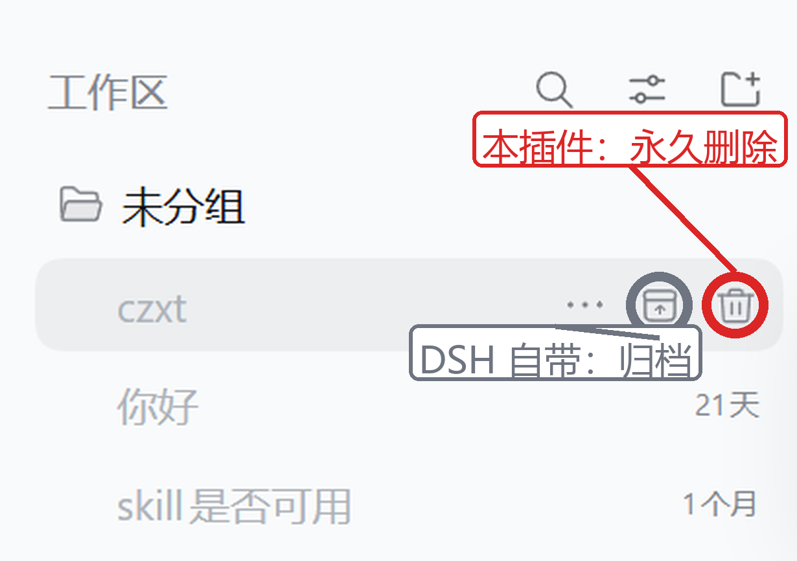

# dsh-session-archive

[](LICENSE)

**DeepSeek Harness 插件：在侧栏会话行上永久删除已归档会话。**

> A [DeepSeek Harness](https://github.com/deepseek-ai) plugin that adds a
> delete button to archived session rows in the sidebar, so you can actually
> clean up sessions you no longer need.

归档（archive）在 DSH 里的语义是「从工作区分组界面隐藏」—— 它**不删数据**。
DSH 自带「归档」与「取消归档」，但归档后的会话长期积累后**没有清理入口**。
本插件补上这一块：在「仅显示已归档」的列表里，每个归档会话的行上出现一个
垃圾桶按钮，两段式确认后**永久删除**。

| 能力 | 说明 |
|---|---|
| 删除入口 | 侧栏会话行的悬停按钮条（`sidebar.workspaces.session.row.action`），紧邻 DSH 自带的归档按钮 |
| 删除范围 | **只对已归档会话出现**；普通会话行上没有该按钮 |
| 删除外观 | DSH 同款垃圾桶图标（`IconTrashOutlineRegular` 的路径内联），图形 **14**（与自带归档按钮同尺寸），盒子 16×16 保持对齐 |
| 删除交互 | 两段式：点图标 → **图标变红**（确认态）→ 再点才执行；失焦或 5 秒后自动取消 |
| 删除效果 | **永久删除**（日志目录 + 投影缓存 + 归档标记 + 工作区归属），**不可恢复** |

## 截图

归档列表里，每个已归档会话的行上会出现本插件的垃圾桶按钮 ——
就在 DSH 自带的**归档**按钮右边：



> 左侧灰色圈是 DSH 自带的「归档」，右侧红圈是本插件的「永久删除」。

## 与 DSH 原生筛选配合使用

在侧栏的「筛选会话」里选 **仅显示已归档**，列表里每个归档会话的行上就会出现
垃圾桶按钮 —— 不需要另开一个设置页。这是刻意的设计：**你本来就在那里看归档
会话**，再让你去设置里找第二个列表既重复又别扭。

## 安装

本插件是标准的 DSH profile 插件包。把它放进 profile 的 `node_modules`，
并在 profile 的 `package.json` 里注册。

> **不需要 npm / pnpm，也不需要构建** —— 仓库的 `lib/` 里已经带了构建好的
> 客户端 bundle，克隆下来直接复制即可。

### 1. 克隆

```bash
git clone https://github.com/ao882866-ux/dsh-session-archive.git
```

### 2. 复制进 profile 的 `node_modules`

**Windows（PowerShell）** —— DSH 桌面端默认在 Windows 上运行：

```powershell
$dst = "$env:USERPROFILE\.dsh\profiles\desktop\node_modules\dsh-session-archive"
New-Item -ItemType Directory -Path "$dst\lib" -Force
Copy-Item lib\*.js "$dst\lib\" -Force
Copy-Item package.json, cordis.patch.yml, README.md, LICENSE $dst -Force
```

**macOS / Linux：**

```bash
mkdir -p "$DSH_HOME/profiles/desktop/node_modules/dsh-session-archive"
cp -r lib package.json cordis.patch.yml \
  "$DSH_HOME/profiles/desktop/node_modules/dsh-session-archive/"
```

> 不确定 profile 路径时：默认是 `~/.dsh/profiles/desktop`（可用环境变量
> `DSH_HOME` 覆盖）。若你用的是别的 profile，把 `desktop` 换成对应的名字。
> 在仓库目录里执行上面的命令即可。

### 3. 注册进 `dsh.profile.bundles`

编辑 `<profile>/package.json`，把包名加进 `dsh.profile.bundles`
（本包自带 `cordis.patch.yml`，bundles 机制会在启动时自动把它叠进 patch 栈）：

```json
"bundles": [ "...", "dsh-session-archive" ]
```

### 4. 重启 DSH

见下节 —— 这一步**不能省**。

### ⚠️ 必须**重启 DSH**，热重载不够

两个真实踩过的坑，都会表现成「界面有按钮，但点了没反应」：

1. **宿主模块不会被重新导入。** ESM 模块一旦被 import 就进缓存，改写
   `lib/index.js` **不会**让 `apply()` 重跑 —— 即使 profile 的
   `patchReload: "live"` 重组了配置树。实测（顶层插桩验证）：改动
   `cordis.patch.yml` 触发重组后，模块顶层代码**没有**再次执行。
   所以改宿主代码后必须重启，否则跑着的仍是旧逻辑。

2. **手写进 `cordis.patch.yml` 的 insert 会被插件管理器抹掉。**
   在 profile 里装/卸任何插件时，DSH 会重写该文件，手写的 `- insert:` 行
   随之消失 → 宿主条目从 loader 树移除 → 端点不存在 → 按钮在（客户端
   bundle 还在浏览器里）但请求打不通。

**结论**：用 `dsh.profile.bundles` 注册（持久、启动时合成），不要只依赖
手写 patch。改动宿主代码后重启。

## 为什么删除必须自己实现

DSH **没有**会话删除 API：

- `ctx.sessionQuery` 只有读（list / search / readTitle / readEvents …）；
- `ctx.workspaceRegistry` 只有 `archiveSession` / `unarchiveSession`；
- `ctx.workspaceController`（Remote 面）同样只有 archive / unarchive / pin。

所以删除只能操作磁盘上的四份状态：

| 目标 | 位置 |
|---|---|
| 会话日志目录 | `$DSH_HOME/sessions/<转义 cwd>/<sessionId>/` |
| 投影缓存 | `$DSH_HOME/storages/session_projcache/sessions/<sessionId>.json` |
| 工作区归属 | `Workspace.detachSession(sessionId)` |
| 归档集合 | `workspaceRegistry.unarchiveSession(sessionId)` |

此外还要把**活着的会话**从内存摘除（`ctx.sessions`），否则
`sessionQuery.listSessions()` 仍会把它列出来 —— 详见下文「删除顺序」。

## 删除顺序（曾经写反，导致「删了又回到未归档列表」）

⚠️ **这是本插件修过的最严重的缺陷**，症状是：点击删除归档会话后，它**又出现
在未归档列表里**，而且此后再也删不掉。

根因是删除顺序反了。旧实现是「**先摘归档标记、再删文件**」，而侧栏的可见性判据是

```js
// dsh-client-ui-workspace 的 sessionVisible()，archivedFilter === 'default'
return !archived.has(session.id)
```

也就是说 **「取消归档」恰恰会让这一行变得可见**。于是只要删文件失败
（文件被占用 / `EPERM` / 瞬时 I/O），结果就是「会话还在磁盘上、但已经不再归档」
—— DSH 于是把它当作一个**普通会话**列出来。更糟的是此后宿主会以
「不在归档集合中」拒绝再次删除，这条会话就既删不掉、又一直占着列表。

现在正确的顺序是：

1. **先把活着的会话从 `ctx.sessions` 摘除**（`liveEntryFor` + `detachEntered`）。
   摘除会触发 `session/disposed` → 持久化写入句柄 `close()`（释放单写者租约，
   避免删完之后后台 append 又把日志文件建出来），并让客户端丢弃该行。
   必须在删文件**之前**，否则后台写入可能重建日志。
2. **删日志目录并复核删净**（`removeTree`：删完检查存在性，仍在则重试）。
   同名会话在多个 bucket 下都有目录时**全部删除**。
3. **删投影缓存**（失败不算致命 —— 它不是会话本体）。
4. **到这里才摘归档标记**（`unarchiveSession`）。
5. **从工作区摘除归属**（`detachSession`）。

这个顺序保证了**失败方向永远是安全的**：

| 失败位置 | 结果 | 用户感受 |
|---|---|---|
| 第 1~3 步 | 会话**原样还在、仍然归档** | 「删除失败，可重试」，会话仍在归档列表里 |
| 第 4 步 | 文件已删净、归档集合还留着（幽灵条目） | 本插件**仍然允许删除**这种条目，可清理 |

无论走哪条失败路径，都**绝不会**留下「不再归档、却还在磁盘上」的会话 ——
那正是用户看到「回到未归档列表」的形态。

客户端侧配套：删除成功后调用 `ctx.sessions.refresh()` 重新拉取列表基线。
宿主摘除活动会话会转发 `api-session/removed`，但会话在删除前若已不在内存中
（进程重启后从未打开过），就不会有这个事件，只能靠主动刷新兜底。

## 安全约定（真实风险）

**删除是不可恢复的**（`deleteSession` 直接 `fs.rm`），故宿主侧有四道闸门
（都在 `lib/index.js`，不在客户端 —— 客户端不做任何安全判定，否则伪造请求
就能绕过）：

1. **只允许删除当前确实处于归档状态的会话**。判据是 id ∈
   `workspace.json` 的 `archivedSessionIds`。没有这道闸门，一个伪造的
   `archive.delete` 就能删掉任意会话。
2. **id 必须先通过形态校验**（`isPlausibleSessionId`）。id 会被拼进文件路径，
   放行 `../` 等于任意文件删除。该校验拒绝路径分隔符、`..` 与非
   `session-<uuid>` / 裸 uuid 的形态。
3. **先删净文件，最后才摘归档标记与工作区归属**。见上文「删除顺序」——
   失败方向必须是「会话原样还在、仍然归档」，绝不能是「不再归档、却还在磁盘上」。
4. **正在运行的会话拒绝删除**。DSH 的写路径持有单写者句柄，日志被抽走会让
   下一次 append 失败，表现为会话无故损坏。

客户端另有**两段式确认**（点一次只上膛、图标变红，再点才执行；失焦或 5 秒
自动取消）—— 不可逆操作绝不能一击执行。

删除成功写 `warn` 级日志、失败写 `error` 级日志（都含会话 id），便于事后追溯。

### 日志目录已缺失的条目仍可删除

真实数据里 78 个归档条目有 17 个日志目录已不存在（会话被外部清理过）。
这类**幽灵条目**恰恰是最该清理的，故「目录不存在」不构成拒绝理由：
宿主照常摘掉归档标记与投影缓存，只是没有目录可删。

## 架构

```
lib/pure.js      纯函数：排序 / 检索 / 可删除性判定 / 工作区解析（可单测，无 IO）
lib/index.js     宿主：RPC 处理器 + HTTP 端点注册 + 文件系统操作
lib/client.js    客户端 bundle（由 client-src/ 经 esbuild 打包）
client-src/      UI 源码（React.createElement，不用 JSX）
```

客户端 bundle 的产物形态必须符合 DSH 客户端模块加载器契约：

```js
window.__ModuleLoader__.load({ id: '<包名>', factory: (require) => { ... } })
```

`id` 必须是**包名**（`dsh-session-archive`），`react` / `react-dom` 必须保持
external（宿主 shell 提供单例；打进来会产生第二个 React 实例，hooks 直接报错）。

宿主侧 `inject = []`，`connection` 通过 `ctx.inject(['connection'], ...)`
**可选挂载**：该服务只由 Web bundle 提供，headless / CLI profile 里不存在，
静态 inject 会让插件在那些 profile 里永久 pending，导致整个 profile
以「1 entry did not activate」启动失败。

## RPC 端点

| 方法 | 作用 |
|---|---|
| `archive.list` | 列出归档会话（含标题 / 工作区 / 大小 / 运行状态） |
| `archive.restore` | 取消归档（单条） |
| `archive.restoreMany` | 取消归档（批量） |
| `archive.delete` | **永久删除**（单条） |
| `archive.deleteMany` | **永久删除**（批量） |

## 开发（改源码才需要）

普通安装**不需要**这一步 —— 见上文，`lib/` 已带构建产物。只有你要改
`client-src/` 或 `lib/index.js` 时才需要：

```bash
pnpm install          # 或 npm install
pnpm build            # 重新生成 lib/client.js
```

> ⚠️ **pnpm 10+ 会拦截依赖的构建脚本**，若不处理，`pnpm install` 会以
> **exit 1** 结束（`ERR_PNPM_IGNORED_BUILDS`），随后 `pnpm build`
> 也会因依赖状态检查失败而报错。esbuild 必须跑 postinstall 才能落地平台二进制。
>
> 仓库已带 `pnpm-workspace.yaml` 显式放行 esbuild，正常克隆下来即可直接安装。
> 若你的环境仍提示，执行一次 `pnpm approve-builds --all` 即可。
>
> 用 npm 不会阻塞（只警告）。

## 已知限制

- **标题来源**：优先 `ctx.sessionQuery.readTitleSnapshots`（权威、live-preferred），
  不可用时回退读投影缓存文件。两者都没有的会话显示「(无标题)」。
- **最后活动时间**：优先取投影缓存文件的 mtime（「最后一次被写」的直接证据），
  否则退回 header 的 `createdAt`（**创建**时间）。
- **事件数**：来自 `sessionPersistence.stat()`；服务不可用时为 0（不臆造）。
- **工作区归属**优先按 sessionId 解析（会话可被移动），退回按 cwd 匹配
  （大小写不敏感 —— Windows 路径大小写不敏感）。
- **删除不可恢复**，没有回收站。这是刻意的设计选择，见上文「安全约定」。
- **删除失败时不会留下「未归档但仍在磁盘」的会话**：这是硬保证，不是尽力而为。
  删文件失败 → 会话原样保持归档；只有摘标记失败 → 留下可再次删除的幽灵条目。
- **同名会话在多个 bucket 下都有目录**时会全部删除；目录若在删除后被后台写入
  重建，`removeTree` 会重试至多 5 次（每次退避 60ms），仍失败则整体报失败并
  保持归档状态。

## License

[MIT](LICENSE)
